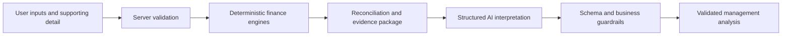

# AI FP&A Variance Analyzer

AI FP&A Variance Analyzer is a portfolio-grade finance application that combines deterministic variance calculations, reconciled supporting evidence, structured AI interpretation, and server-side business guardrails.

V1 established the deterministic variance engine. V2 added server-side AI commentary. V3 replaced free-form commentary with schema-enforced structured AI output. V4 added supporting-detail evidence and reconciliation. V5 added explicit trust boundaries, deterministic output guardrails, adversarial tests, and repeatable evaluation. V6 presents those capabilities through a production-quality, responsive workflow. V7 makes the complete application publicly available on Vercel.

## Live Demo

[Open the live AI FP&A Variance Analyzer](https://ai-fpa-variance-analyzer.vercel.app)

## Production Deployment

The public application is hosted on Vercel. `OPENAI_API_KEY` is configured as a server-side Vercel environment variable and is never included in the client bundle.

Production testing verified the public workflow end to end: deterministic calculations, supporting-detail reconciliation, 100% default evidence coverage, successful structured AI output, schema validation, and business guardrails. The default analysis correctly identifies Salesforce and Snowflake as the two largest financial variance contributors while keeping the underlying causal drivers explicitly unresolved.

## Screenshots

The repository includes a [screenshot guide](docs/screenshots/README.md) with recommended views and filenames for portfolio captures. No placeholder screenshots are presented as real product captures.

## What It Demonstrates

- Deterministic finance calculations remain authoritative and auditable.
- Supporting detail reconciles to top-level results and quantifies evidence coverage.
- Structured AI output is schema validated and checked against business rules before display.
- Variance contributors are distinguished from deeper operational root causes.
- Untrusted text is separated from trusted instructions at the server boundary.
- Loading, error, stale-result, responsive, and accessible interaction states are handled explicitly.

## Architecture



The browser calculates an immediate preview, but the server independently recomputes every financial result before building the AI context. The model interprets verified evidence; it never owns the calculations.

## Version Journey

| Version | Capability | Status |
| --- | --- | --- |
| V1 | Deterministic variance engine | Complete |
| V2 | Server-side AI commentary | Complete |
| V3 | Schema-enforced structured output | Complete |
| V4 | Supporting evidence and reconciliation | Complete |
| V5 | Guardrails, adversarial tests, and evaluation | Complete |
| V6 | Production-quality portfolio UI | Complete |
| V7 | Public deployment on Vercel | Complete |

## Reliability

The normal quality pipeline is API-free and repeatable: TypeScript validation, ESLint, a production build, a 33-test unit and integration suite, and a 12-scenario deterministic evaluation. Live-model evaluation is isolated behind `npm run eval:live` so routine validation never incurs API cost or introduces model nondeterminism.

## Architectural Principle

**Use deterministic code for deterministic tasks. Use AI for interpretation, reasoning, language, and ambiguity.**

## V1 Deterministic Architecture

V1 provides a small FP&A variance analysis interface for one expense account/category. Users enter:

- Account / Category
- Period
- Actual
- Forecast
- Prior Year
- Materiality %
- Materiality $

The app calculates forecast variance, prior year variance, expense variance direction, and materiality using deterministic TypeScript logic.

The deterministic engine remains authoritative for:

- Forecast variance dollars
- Forecast variance percentage
- Prior-year variance dollars
- Prior-year variance percentage
- Materiality
- Variance direction
- Zero-denominator handling
- Numeric input validation

## V2 Hybrid Architecture

V2 introduces AI-generated management commentary using a server-side OpenAI API call.

```text
User Inputs
    ↓
Client UI
    ↓
Server API Route
    ↓
Shared Deterministic TypeScript Engine
    ↓
Verified Financial Results
    ↓
OpenAI Responses API
    ↓
AI Management Commentary
    ↓
User
```

The browser sends original financial inputs and materiality settings to `POST /api/analyze`. The server route does not trust browser-calculated values. It recomputes the variance analysis with the shared deterministic TypeScript engine before constructing the LLM context.

The OpenAI API is used only after verified financial results exist.

## V3 Structured Output Architecture

V3 moves from free-form model text to enforced structured output:

```text
User Inputs
    ↓
Client UI
    ↓
POST /api/analyze
    ↓
Server Validation
    ↓
Shared Deterministic TypeScript Engine
    ↓
Verified Financial Results
    ↓
OpenAI Responses API
    ↓
Schema-Enforced Structured Output
    ↓
Server Validation / Typed Result
    ↓
Structured UI Components
```

The AI response is constrained to this application contract:

```json
{
  "executiveCommentary": "...",
  "knownFacts": ["..."],
  "rootCauseKnown": false,
  "unknownDrivers": ["..."],
  "recommendedFollowUp": ["..."]
}
```

The app uses the OpenAI Responses API structured-output capability with a Zod schema. This is different from merely asking the model to "return JSON." A prompt-only JSON request may produce JSON-looking text, but it does not provide the same schema-constrained contract or typed parsed result.

## Schema Validation vs Business Validation

Schema validation verifies structure:

- Required fields are present.
- Field names use the expected camelCase contract.
- Strings, booleans, and string arrays have the expected types.
- Unexpected fields are rejected.

Business validation verifies meaning:

- V3 has no supporting root-cause evidence.
- Therefore `rootCauseKnown` must be `false`.
- If a model response marks root cause as known, the server rejects it even if the JSON structure is otherwise valid.

Both checks matter. Schema validation protects the shape of the data, while business validation protects the finance logic and evidence rules.

## V4 Supporting Evidence Architecture

V4 adds editable vendor-style support rows for the Software Expense example. The default support detail is:

| Name | Actual | Forecast | Variance |
| --- | ---: | ---: | ---: |
| Salesforce | $180,000 | $120,000 | $60,000 |
| Snowflake | $140,000 | $100,000 | $40,000 |
| Microsoft | $105,000 | $100,000 | $5,000 |
| Other | $200,000 | $180,000 | $20,000 |

These rows reconcile to the default top-level example:

- Actual: $625,000
- Forecast: $500,000
- Forecast variance: $125,000

```text
User Inputs + Supporting Detail
        ↓
Server Validation
        ↓
Top-Level Deterministic Engine
        +
Supporting Detail Deterministic Engine
        ↓
Reconciliation
        ↓
Evidence Coverage / Sufficiency
        ↓
Verified Evidence Package
        ↓
OpenAI Structured Output
        ↓
Business Validation
        ↓
Structured UI
```

Supporting rows are useful because they move the analysis from "variance exists" toward "where the variance sits." The application still distinguishes a variance contributor from an ultimate operational root cause.

For each support row, deterministic code calculates:

- Row variance dollars: `actual - forecast`
- Row variance percentage: `(actual - forecast) / forecast * 100`
- Contribution percentage: `row variance dollars / top-level forecast variance * 100`

The default contribution analysis is:

- Salesforce: 48%
- Snowflake: 32%
- Microsoft: 4%
- Other: 16%

The app also calculates reconciliation and evidence coverage:

- Support actual total vs top-level actual
- Support forecast total vs top-level forecast
- Support variance total vs top-level forecast variance
- Unexplained variance
- Evidence coverage percentage

Evidence is sufficient only when:

1. Variance reconciliation is true.
2. Support explains at least 90% of the absolute top-level forecast variance.
3. At least one support row has a non-zero variance.

This is deterministic business logic, not an LLM judgment.

## Why Calculations Stay Outside the LLM

Financial calculations are deterministic and auditable. The LLM should not be asked to calculate variance dollars, percentages, materiality, or direction. Those responsibilities belong to application code.

AI is used for the part that benefits from language and judgment: concise CFO-ready interpretation, known facts, evidence-supported variance contributors, explicit unknowns, and recommended follow-up analysis.

Structured outputs make the AI result safer for downstream application use. The UI can render each field intentionally, future versions can store or compare individual fields, and later workflows can consume typed data instead of parsing prose.

## Server-Side Trust Boundary

Client input is untrusted. Server-side deterministic logic is authoritative.

The UI may display deterministic V1 results immediately for responsiveness, but the API route independently derives the authoritative values used in the AI prompt.

## V5 Validation, Guardrails, and Evaluation

V5 moves the project from a working AI feature to an AI system with explicit controls around what may be trusted. The trust hierarchy is:

1. Server-side deterministic calculations
2. Server-side business rules and validation
3. Schema-validated application contracts
4. Verified supporting evidence
5. LLM interpretation
6. Raw user-supplied text

The LLM cannot override a higher-trust layer. The server recomputes every financial result, packages verified evidence, validates the model response against a strict schema, and then compares its structured claims with deterministic results before returning anything to the browser.

```text
User Inputs
    ↓
Input Validation
    ↓
Server Trust Boundary
    ↓
Deterministic Financial + Supporting Evidence Engines
    ↓
Reconciliation / Evidence Sufficiency
    ↓
Verified Evidence Package
    ↓
LLM with Trusted-Instructions / Untrusted-Data Separation
    ↓
Schema Validation
    ↓
Business Guardrails
    ↓
Structured UI or Safe Failure
    ↓
Evaluation / Regression Tests
```

### Input Guardrails

Server validation requires non-empty account and period fields, finite financial values, non-negative materiality thresholds, valid supporting rows, bounded text lengths, at most 100 support rows, and a bounded request body. Invalid data is rejected with a sanitized message and is never silently truncated. Financial values have no arbitrary amount cap.

### Prompt-Injection Boundary

Account, period, support names, and future descriptive evidence are untrusted literal data. The verified evidence package labels text fields accordingly and places them inside a delimited data block separate from trusted application instructions. The trusted instructions explicitly prohibit following instructions embedded in data fields.

This is defense in depth, not a keyword filter:

```text
trusted instructions
+ untrusted-data separation
+ deterministic calculations
+ structured output
+ business validation
+ evaluation
```

Prompt injection cannot be solved simply by telling a model to ignore prompt injection. The application also prevents untrusted text from changing calculations, verifies structured claims against known support rows, and rejects contradictions before display.

### Three Validation Layers

Schema validation asks: **Did the AI return the correct structure?**

Business validation asks: **Does the structured answer obey verified financial rules?**

Evaluation asks: **Does the complete system behave correctly across expected and adversarial scenarios?**

These layers remain separate. Zod and the Responses API enforce the application contract. The deterministic guardrail engine then verifies root-cause status, contributor sufficiency, driver identity, driver variance and contribution values, top-level variance, percentage, materiality, and reconciliation. A structurally valid response can still fail business validation.

The internal guardrail contract is:

```ts
type GuardrailResult = {
  passed: boolean;
  failures: string[];
};
```

Critical failures are not displayed as management analysis. The browser receives a professional validation error, while server diagnostics record only safe failure categories rather than API keys, hidden instructions, or raw financial payloads.

### Deterministic and Live Evals

`npm run eval` executes twelve deterministic scenarios locally with no OpenAI call:

- Default reconciled evidence
- Partial evidence below 90% coverage
- Unreconciled support
- No supporting rows
- Zero denominator
- Non-material variance
- Unsupported root cause
- Invented driver
- Prompt-injection-like row name
- Invalid numeric input
- Invalid support row
- Stale analysis invalidation

`npm run eval:live` is an optional, API-using suite for default reconciled evidence, insufficient evidence, an injection-like row name, and a non-material variance. It requires `OPENAI_API_KEY`, uses a small fixed scenario set, and judges structured output with the same deterministic guardrails rather than another LLM. It is never run by `test`, `build`, or other normal quality checks.

This separation keeps normal development deterministic, fast, and free of API cost while still providing an explicit path to measure live model behavior. Qualitative writing quality remains a human-review concern; V5 does not pretend it has an objective automated score.

### Portfolio Value

V5 moves the project beyond a basic LLM integration by adding deterministic guardrails, adversarial test cases, and repeatable evaluation. The objective is not merely to generate plausible AI output, but to verify that AI behavior remains bounded by trusted financial logic.

## V6 Production UI

V6 turns the established V1-V5 system into a coherent finance workflow: calculate, reconcile, interpret, and validate. It improves information hierarchy, separates entered evidence from calculated fields, makes trust signals visible at the point of use, and gives structured AI output a stable layout across idle, loading, success, and failure states.

The visual layer does not change the calculation, reconciliation, evidence-sufficiency, schema, or business-guardrail rules. It makes those existing boundaries easier to understand and audit.

## Project Structure

- `app/page.tsx` contains the interactive React UI and input validation.
- `app/api/analyze/route.ts` contains the server-side AI analysis route.
- `lib/variance.ts` contains reusable deterministic financial calculation logic and TypeScript types.
- `lib/supporting-detail.ts` contains deterministic supporting-detail calculations, reconciliation, evidence coverage, and evidence sufficiency.
- `lib/analysis-request.ts` validates API request payloads.
- `lib/ai-management-analysis.ts` contains server-only OpenAI Responses API integration.
- `lib/management-analysis-schema.ts` defines and validates the structured output contract.
- `lib/analysis-guardrails.ts` checks structured claims against deterministic financial facts.
- `lib/verified-evidence.ts` creates the instruction-separated evidence package.
- `lib/management-analysis-prompt.ts` contains trusted model instructions.
- `lib/ai-analysis-state.ts` contains the small client-side AI result state contract.
- `scripts/evaluate-v5.ts` runs the API-free twelve-scenario V5 evaluation.
- `scripts/evaluate-live.ts` runs the optional four-scenario live-model evaluation.
- `tests/` contains focused finance, evidence, schema, business-guardrail, adversarial-input, and stale-state tests.
- `app/globals.css` contains the responsive FP&A-style interface styling.
- `docs/screenshots/` documents the capture set for the public portfolio release.

The calculation module is separated from the UI and OpenAI integration so it can be unit tested independently.

## Deterministic vs AI Responsibilities

Deterministic application code is responsible for:

- Numeric calculations
- Materiality rules
- Variance direction rules
- Safe handling of zero denominators
- Formatting and validation support
- Supporting-detail variance and contribution calculations
- Reconciliation and evidence sufficiency

AI is responsible for:

- Explaining verified variance contributors in plain language
- Interpreting ambiguous business context
- Drafting narrative commentary
- Reasoning from supporting evidence

In V4, vendor-level support can identify major financial variance contributors. It does not automatically prove the deeper operational cause. AI output should avoid unsupported claims about pricing, volume, license count, renewal timing, vendor behavior, or other causal mechanisms unless supplied evidence supports them.

## Calculation Formulas

Forecast Variance $:

```text
Actual - Forecast
```

Forecast Variance %:

```text
(Actual - Forecast) / Forecast * 100
```

Prior Year Variance $:

```text
Actual - Prior Year
```

Prior Year Variance %:

```text
(Actual - Prior Year) / Prior Year * 100
```

Material:

```text
absolute Forecast Variance % > Materiality %
OR
absolute Forecast Variance $ > Materiality $
```

For the V1 expense use case:

```text
Actual > Forecast = Unfavorable
Actual < Forecast = Favorable
Actual = Forecast = Neutral
```

This direction rule currently assumes an expense account. Revenue accounts require a different direction rule.

When Forecast or Prior Year is zero, the related percentage variance is shown as unavailable instead of producing `NaN` or `Infinity`.

## Run Locally

Install dependencies:

```bash
npm install
```

Create a local environment file:

```bash
cp .env.example .env.local
```

Add your real API key to `.env.local`:

```text
OPENAI_API_KEY=<your key>
```

Do not commit `.env.local`. The real API key must remain server-side only.

Start the development server:

```bash
npm run dev
```

Run quality checks:

```bash
npm run lint
npm run typecheck
npm run build
npm run test
npm run eval
```

Optional live-model evaluation:

```bash
npm run eval:live
```

## OpenAI API Security

The application uses the official OpenAI JavaScript/TypeScript SDK with the Responses API from a server-side Next.js route.

- API key variable: `OPENAI_API_KEY`
- Model: `gpt-5.6-luna`
- Route: `POST /api/analyze`
- Output: schema-enforced structured JSON parsed into typed application data
- Browser calls only the application server route, never OpenAI directly.
- Production configures `OPENAI_API_KEY` as a server-side Vercel environment variable.
- No `NEXT_PUBLIC_` API key is used.
- No real secrets are committed.
- Normal tests and deterministic evaluations make no OpenAI calls.
- Logs contain safe validation categories, not prompts, keys, or raw request payloads.

## Current Limitations

- Supports one manually entered variance scenario at a time.
- Direction logic assumes an expense account.
- No saved scenarios or database persistence.
- No file upload or spreadsheet ingestion.
- Vendor-level support identifies financial contributors, not deeper operational root causes.
- Evidence is manually entered and not persisted.
- Structured guardrails validate explicit fields and deterministic claims; they do not attempt brittle parsing of every possible sentence in AI prose.
- Live-model behavior remains nondeterministic and should be reevaluated when prompts, schemas, evidence rules, or models change.
- V7 deployment does not add authentication, persistence, or production monitoring.

## Roadmap

- V1 — Deterministic variance engine — COMPLETE
- V2 — AI API integration — COMPLETE
- V3 — Structured JSON output — COMPLETE
- V4 — Supporting evidence and driver analysis — COMPLETE
- V5 — Validation, guardrails, and evaluation — COMPLETE
- V6 — Production-quality UI — COMPLETE
- V7 — Public deployment — COMPLETE
